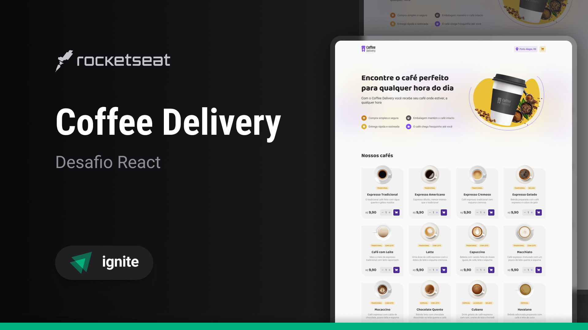

# Coffee Delivery ☕

<p align="center">
    
</p>

Uma aplicação de e-commerce de café para gerenciar um carrinho de compras. Desenvolvida em ReactJS com TypeScript, aplicando conceitos como Context API, imutabilidade e manipulação de estado.

## 🚀 Tecnologias

- [ReactJS](https://reactjs.org/)
- [TypeScript](https://www.typescriptlang.org/)
- [Vite](https://vitejs.dev/)
- [Styled Components](https://styled-components.com/)
- [React Router](https://reactrouter.com/)
- [React Hook Form](https://react-hook-form.com/)
- [Zod](https://zod.dev/)
- [Immer](https://immerjs.github.io/immer/)

## 💻 Projeto

Coffee Delivery é uma aplicação web para gerenciar um carrinho de compras de uma cafeteria fictícia.

## 📐 Layout no Figma

[Acessar Layout no Figma](https://www.figma.com/file/5yT9ZzZmRQRS4yivGGB3pl/Coffee-Delivery/duplicate)

## 🛠️ Instalação

```bash
# Clone o repositório
git clone https://github.com/Robson16/coffee-delivery.git

# Entre na pasta do projeto
cd coffee-delivery

# Instale as dependências
npm install

# Execute a aplicação
npm run dev
```

## 📝 Licença

Este projeto está sob a licença MIT. Veja o arquivo [LICENSE](LICENSE) para mais detalhes.

---

Feito com ☕❤ por [Robson H. Rodrigues](https://github.com/Robson16)
